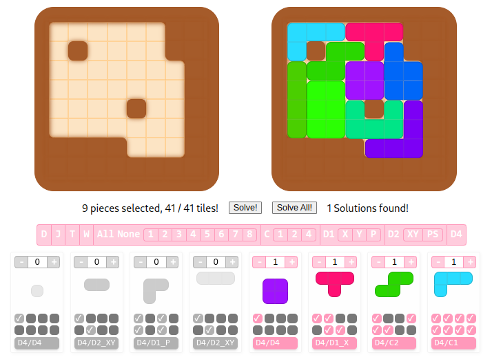

# Polyomino Puzzle Solver

A web-based puzzle solver powered by a high-performance C++23 engine and an intuitive React frontend. This project visualizes the solution process for complex tiling puzzles using efficient backtracking search algorithms optimized with bit manipulation techniques.

**[Website](https://d4-pieces.netlify.app/)**

[](https://d4-pieces.netlify.app/)

## Features

- **Efficient Solving**: Utilizes a backtracking search algorithm with fast bit manipulation optimizations for quick and accurate solutions.
- **Modern Tech Stack**: Combines C++23 for high-performance computation with a React frontend for a responsive user interface.
- **Interactive UI**: Clean and smooth UI styled with CSS and engaging animations.
- **WebAssembly Integration**: High-performance C++ engine compiled to WebAssembly via Emscripten for seamless browser execution.

## Tech Stack

- **Backend Engine**: C++23 with performance optimizations
- **WebAssembly**: Compiled using Emscripten for browser compatibility
- **Frontend**: React.js & webpack
- **Styling**: CSS & animations
- **Algorithm**: Backtracking search with bit manipulation optimization

## Installation

### Prerequisites
- Node.js
- npm or yarn
- Emscripten SDK for WebAssembly compilation

### Build Steps

1. **Clone the Repository**
   ```bash
   git clone --depth=1 https://github.com/yourusername/puzzle-solver.git
   cd puzzle-solver
   ```

2. **Install Dependencies**
   ```bash
   (cd website && npm ci)
   ```

3. **Compile C++ Engine to WebAssembly**
   ```bash
   ./compile.sh
   ```

4. **Run the Development Server**
   ```bash
   (cd website && npm start)
   ```

5. **Open in Browser**
   Visit `http://localhost:3000` to interact with the puzzle solver.

## Usage

- Click **Solve!** to find a single solution.
- Click **Solve All!** to enumerate all possible solutions.
- Visualize the solution steps and puzzle configurations interactively.

## License

This project is licensed under the MIT License.
